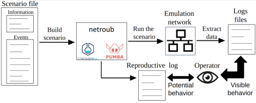

# Netroub

Netroub is a platform capable of emulating complex and realistic network trouble scenarios to collect synthetic operational data.
Netroub reproduces network failure behaviors described in a scenario file on Docker-based emulation networks.

## Overview



## Requirements

- Docker
- [Pumba](https://github.com/alexei-led/pumba)
- [containerlab](https://containerlab.dev/) or [tinet](https://github.com/tinynetwork/tinet)
- [dot2net](https://github.com/cpflat/dot2net) (optional)

## Usage

### Build

    go build .

  (Optional) You can move the binary file generated in /usr/bin to execute netroub without entering its binary file path.

    mv netroub /usr/bin/netroub

### How to run a scenario

    netroub /path/to/scenario/file.json

  It is also possible to execute scenario file written in yaml.

    netroub --yaml /path/to/scenario/file.json

## Scenario file

| Field        | Type   | Description
|:-------------|:------ |----------------
| scenarioName | string | Name of the scenario (useful for outputs)
| logPath      | string | Path to the output repository
| topo         | string | Path to the topology file required by Containerlab
| events       | array  | Array of event to be applied during scenario execution

## Citation

If you use this tool in your research, consider citing our CoNEXT 2023 student workshop publication (currently to appear).

``` bib
@inproceedings{colin_netroub,
  title={netroub: Towards an Emulation Platform for Network Trouble Scenarios},
  author={Colin Regal-Mezin, Satoru Kobayashi, Toshihiro Yamauchi},
  booktitle={Proceedings of the 19th International Conference on emerging Networking EXperiments and Technologies (CoNEXT’23) Student Workshop},
  publisher={ACM},
  year={2023},
}
```
